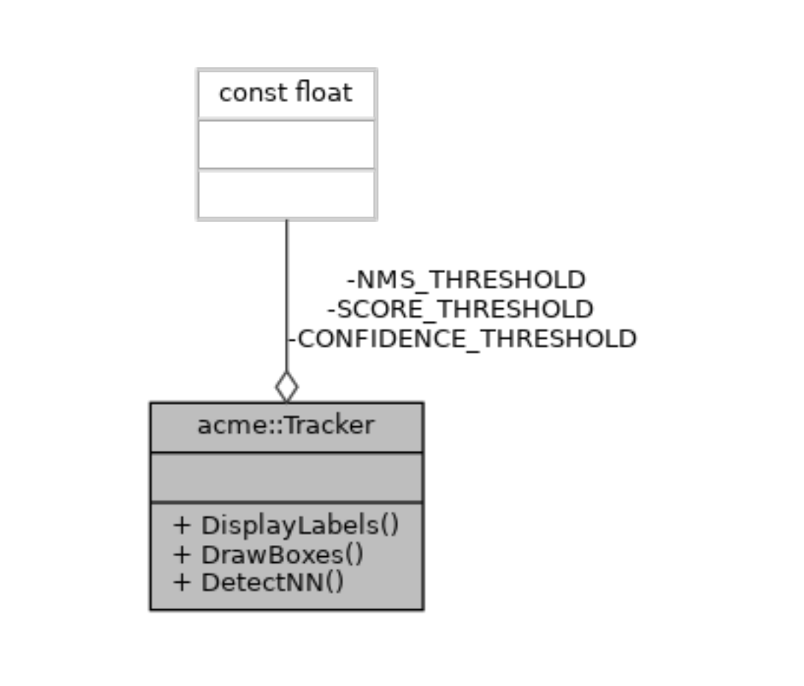
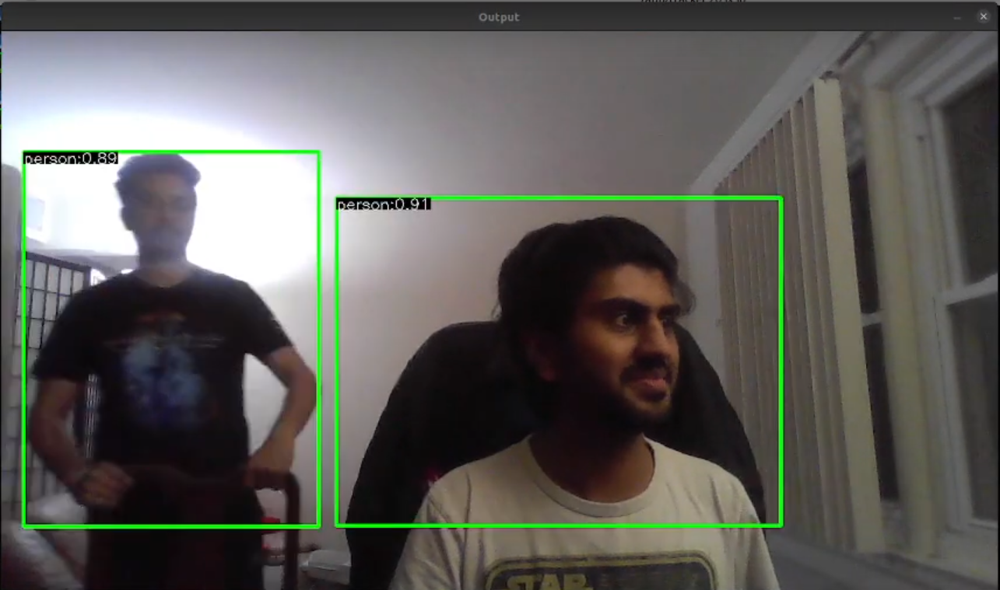
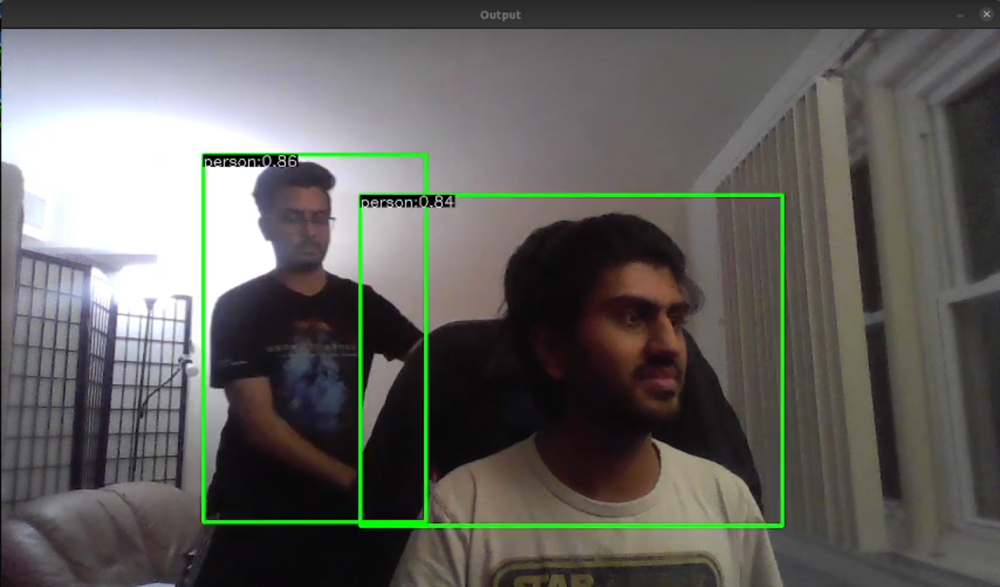
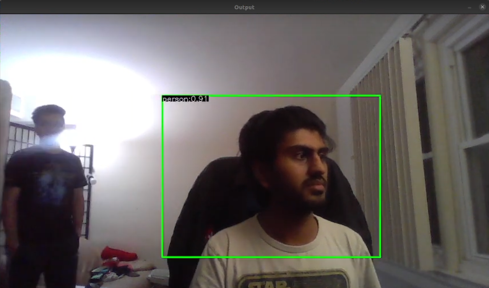
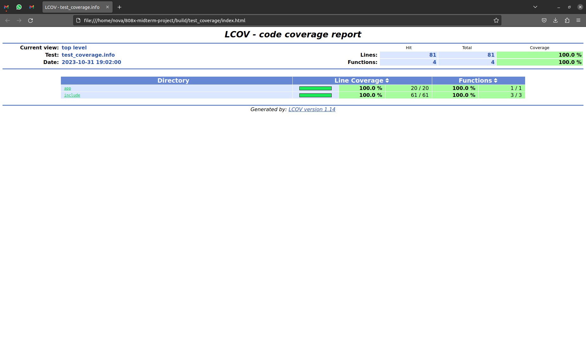

# 808x-midterm-project


[](https://codecov.io/gh/KshitijKarnawat/808x-midterm-project)
[](LICENSE)

## Project Overview

In the context of the Collaborative Industrial Robot (CIR), our project focuses on the imperative task of real-
time human detection and tracking. Our solution entails a specialized human detection and tracking module,
leveraging advanced computer vision algorithms. It abstracts the intricacies of the underlying algorithms
and offers three operational modes: training, testing, and real-time execution.
Throughout the project, we will follow Agile Iterative Processs (AIP) to optimize our software devel-
opment process. In the initial sprint, we implement backlog requirements, monitor bugs, and introduce
features, while daily meetings ensure progress and resolve conflicts. Each sprint concludes with an iteration
review for code and backlog assessment in preparation for the next sprint. This can be integrated with other
modules like Controls and Motion planning/navigation to develop a fully operational robot.

## Author information

- Kshitij Karnawat (<kshitij@terpmail.umd.edu>)
- Hritvik Choudhari (<hac@terpmail.umd.edu>)

## License

License under MIT License.

## Dependencies

- OpenCV 4.7.* or higher
- CMake 3.2 or higher
- Ubuntu 18.04 or higher
- GoogleTest (for testing)
- Doxygen
- Graphviz
- Cpplint
- CppCheck

## Dependencies Installation

```sh
sudo chmod +x requirements.sh
./requirements.sh
```

## UML Diagrams



## Quad Chart


## [Agile Iterative Process Sheet](https://docs.google.com/spreadsheets/d/1ClVrcb1FtqD7OdxFqPrhnZTfMS6CZsh9HTW7clclphI/edit?usp=sharing)

## [Planning Sheet](https://docs.google.com/document/d/1iMmyf-nXXenmKZDXkSh4wu5QEsInimkXTg0Oqb2PvHU/edit?usp=sharing)

## Building and Running

### Build

```sh
# Clone the repository
git clone

# Create a build directory
mkdir build && cd build
cmake ..
make

# To generate documentation
cd ..
cmake --build build/ --target docs
```

### Run

```sh
# Running the application
cd build/
./app/tracker

# Press 'esc' to exit the application

```

### Test

```sh
# Running test
cd build/; ctest; cd -

# Running Code Coverage
cmake -D WANT_COVERAGE=ON -D CMAKE_BUILD_TYPE=Debug -S ./ -B build/
cmake --build build/ --clean-first --target all test_coverage
```

## Results

### Human Detection and Tracking



### Overlapping Detections



### Occluded Detections



## Known Issues

- Gtk-Message: 05:12:10.167: Failed to load module "canberra-gtk-module"
<!-- - For CodeCov to get 100% coverage, we need to atleast one successful detection as seen below. Getting this on the CodeCov badge is not possible as the server does not detect from camera.
 -->


## Other development Documets

- [OpenCV Documentation](https://opencv.org/)
- [Google Test Suite - 1](https://chromium.googlesource.com/external/github.com/google/googletest/+/refs/heads/v1.8.x/README.md)
- [Google Test Suite - 2](http://google.github.io/googletest/)

## Videos

- [Proposal](https://www.youtube.com/watch?v=stZ0M5cbaZc)
- [Phase 1 Update](https://youtu.be/rU7ts5qoDmg)
- [Phase 2 Update](https://drive.google.com/file/d/1CscyLXwQ_gGGZHPRzdFkZS4jBpGGwEHI/view?usp=sharing)

## References

- [OpenCV Documentation](https://docs.opencv.org/master/)
- [OpenCV Tutorials](https://docs.opencv.org/master/d9/df8/tutorial_root.html)
- [YoloV7](https://arxiv.org/abs/2207.02696)
- [YoloV7 Implementation in Python](https://github.com/ultralytics/YOLOv5)
